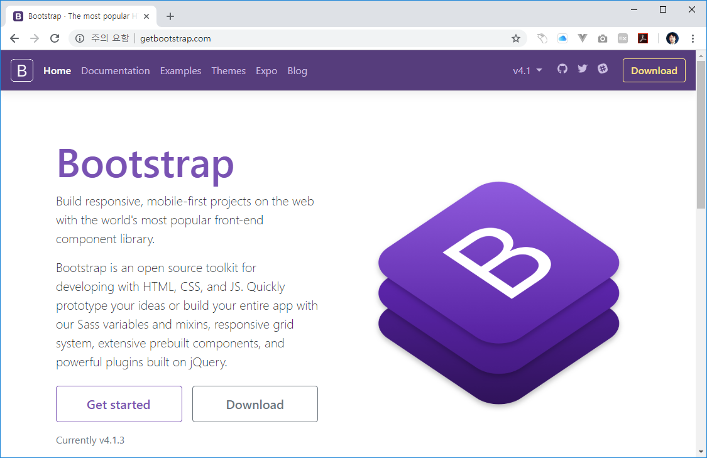

# CSS
---
웹은 일반인들이 흔히 문서작성용으로 사용하는 워드와 같이 문서를 작성하는데 한계가 있습니다.  
문서를 보기 좋게 꾸미고. 색상을 추가 하기 위해서는 CSS를 같이 사용해야 합니다.

<br><br>
## 스타일 라이브러리
---
이전 이미지를 통하여 디자인을 하는 것보다 CSS스타일의 코딩은 빠른 웹브라우저 랜더링과 적은 네트워크를 소모합니다.  
최근들어서는 다양한 종류의 CSS 스타일 라이브러리가 존재합니다. 그중에서 가장 많은 인기를 얻고 있는 것은 부트스트랩입니다.

<br>
### 부트스트랩
---
부트스트랩은 트위터에서 개발된 `CSS 라이브러리` 입니다.  
만일 css로 디자인을 하기에 아직 실력이 부족하다면 css라이브러리인 트위터의 부트스트랩을 사용해 보는 것도 좋은 방법입니다.

<br>
부트스트랩은 `http://getbootstrap.com/`에서 무료로 다운로드 받을 수 있습니다.  
<br>


<br><br>
## 리소스경로
---
프레임워크에서 사용되는 대부분의 CSS 파일들은 `/public/assets/css` 폴더안에 있습니다.  
`/public`폴더는 다른 유사 프레임워크에서도 같은 이름으로 사용을 합니다.  

<br>
### public 의미
---
모든 외부의 css 리소스들을 `/public` 서브폴더로 관리하는 이유는 보안상 접근을 제한하기 위해서 입니다.  
프레임워크를 처음 기동할때 `-t ./public`으로 하게 되면 `document root`가 public으로 실행됩니다.  
문서의 시작위치를 조정하여 외부로 부터 접근될 수 있는 악의 적인 요청을 제한할 수 있습니다.

<br>
### public 링크
---
php 서버의 문서 시작위치로 설정하게 되면 모든 리소스의 링크 주소는 `/asset/~~`으로 잡으면 됩니다.  
하지만 일반적인 호스팅과 같이 문서의 시작위치를 설정할 수 없는 경우에는 지니PHP 루트 폴더에서 시작하게 됩니다.

이런경우에는 `/public/asset/~~`으로 설정해 주셔야 합니다.   

<br>
### 자동링크
---
리소스의 경로를 서버를 실행할때 마다 변경을 하는 것은 매우 불편합니다.  
지니PHP는 자동으로 문서를 시작 위치를 지정할 수 있는 ROOT 상수를 내부적으로 제공합니다.  

그리고 ROOT 상수값을 이용하여 자동적으로 `view`화면을 랜더링 하게 됩니다.  

프로젝트 루트에서 실행할 경우에는 `/index.php`가 실행이 됩니다. 이곳에서 루트 상수가 설정이 됩니다.
```php
define("ROOT", ".");
```

만일 서버의 루트 실행이 `/public`일때는 `/public/index.php`가 실행이 됩니다.

```php
define("ROOT", "..");
```

즉, 실행위치에 따라서 `ROOT` 상수의 값은 달라지게 됩니다.

<br>
### 케쉬충돌
---
서버 실행의 위치에 따라서 링크의 자동수정 기능은 유용합니다. 하지만, 링크의 수정기능은 캐시를 생성하고 처리하는데 문제를 발생합니다.  

지니PHP는 속도를 개선하기 위해서 페이지 랜더링후 캐쉬파일을 생성하게 됩니다.  
캐쉬 파일은 자동수정된 링크 주소값을 가지고 있습니다.  

만일, 서버를 `/`에서 실행후에 다시 `/public`으로 실행하게 되면, 캐쉬의 저장된 경로값이 일치하지 않습니다. 
이런경우 캐쉬를 삭제하거나, 컨덴츠를 수정하게 되면 캐쉬를 다시 만들게 됩니다.  

<br><br>
## CSS 적용
---
작성된 CSS 파일을 페이지에 적용을 할 수 있습니다.  
CSS를 적용하는 방법은 두가지가 있습니다. 전체 페이지에 공통적으로 적용하는 방법과 개별적으로 적용하는 방법입니다.  

<br>
### 공통적용
---
공통적으로 작성한 CSS 스타일을 적용하는 방법은 테마를 통하여 설정하는 것입니다.  
테마에는 공통적으로 동작되는 `layout.htm` 파일이 있습니다.  

테마 기능이 활성화 된 경우, 지니PHP의 모든 페이지들은 테마와 결합을 하게 됩니다.  
따라서 테마의 `layout.htm` 파일에 CSS 설정 링크를 저장해 두시면 됩니다.


<br>
### 개별적용
---
개별 적용이란 각각의 페이지마다 CSS를 적용하는 방법입니다.  
페이지의 개별 CSS 적용 방법은 지니PHP의 특수한 `머리말`기능을 이용하는 것입니다.  

머리말은 페이지의 전달할 수 있는 배열의 데이터 값입니다. 배열 값은 `ymal`이라는 데이터문자열 포맷을 이용합니다.  

```php
css: "/asset/custom.css"
```

지니PHP는 머리말에 `css` 키값이 있는지를 판별합니다. css 키값이 존재하게 되면 커스텀 css 설정 루틴이 동작을 하게 됩니다.  
커스텀 css 설정은 한개의 파일 또는 여러개의 파일을 설정할 수 있습니다.  

만일 여러개의 커스텀 css 파일을 적용하고자 하는 경우에는 `yaml` 양식중에 서브배열 작성법을 통하여 설정할 수 있습니다.  

```php
css: 
- "/asset/custom.css"
- "/asset/custom2.css"
```

위와 같이 여러개의 css를 설정할 수 있습니다.  


<br>
### 개별CSS 적용 주의사항
---
개별 페이지에 추가된 CSS는 `</head>`테마 위에 삽입됩니다. 따라서, 가장 마지막에 등록된 CSS 스타일로 적용이 됩니다.  
만일 이전에 스타일값이 중복될 경우에는 주의하기실 바랍니다.

<br>
<br>
<br>
<br>